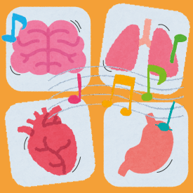
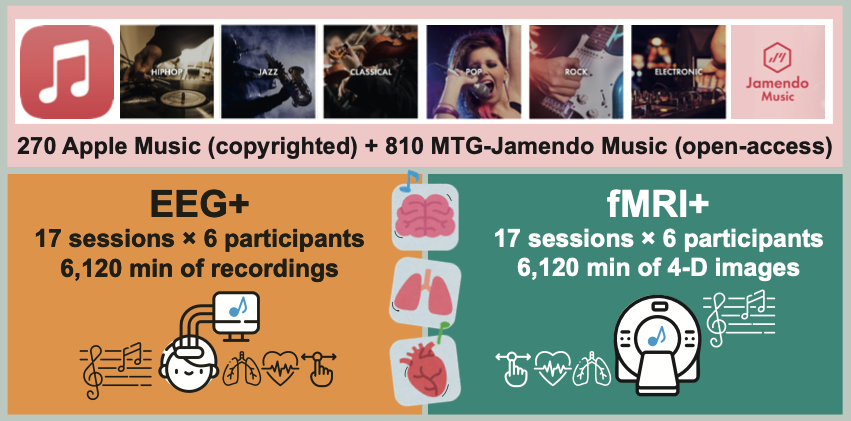

<!--  -->

ManyMusic🎵[^1] is a project dedicated for deep-phenotyping of music-evoked emotions using 1K+ full-length musical pieces, continuous emotional rating timeseries, electrophysiological signals, and functional neuroimaging data.

This project is still ongoing. We finished the stimulus curation and validation phases, and we are currently collecting EEG+ data. The data and code will be made openly available upon the project completion.

Please see our recent [poster] for the current status of the project as of Jan 2026.

## News & Updates
- 2025-12-11: [ManyMusic-Rec] EEG+ data recording has been started! Check out the dashboard for the current progress. 📊
- 2025-10-14: [ManyMusic-Stim] HCMIR workshop paper is published! Stimulus set and validation data are now available. 🎉
- 2025-09-15: ManyMusic website is launched! 🚀

## Subprojects

- [ManyMusic-Stim]
- [ManyMusic-Rec]

More to come! 😃

----
[^1]: The work is a collaboration between the [Max Planck Institute for Empirical Aesthetics](https://www.aesthetics.mpg.de/en.html) and [Pompeu Fabra University](https://www.upf.edu/web/mtg). Main contributors are [Seung-Goo Kim](https://github.com/seunggookim/), [Pablo Alonso](https://github.com/palonso), and [Dmitry Bogdanov](https://github.com/dbogdanov). Project supervisor is [Apl. Prof. Daniela Sammeler](https://www.aesthetics.mpg.de/en/the-institute/people/daniela-sammler.html). Please direct any questions or comments to [Seung-Goo Kim](mailto:seung-goo.kim@ae.mpg.de).

[ManyMusic-Rec]: /rec/
[ManyMusic-Stim]: /stim/
[poster]: /figs/kim+.2025.musafx.sab.pdf